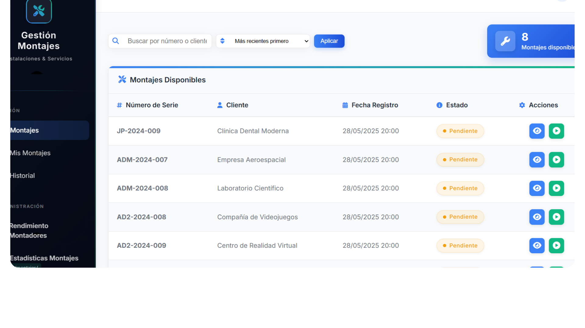
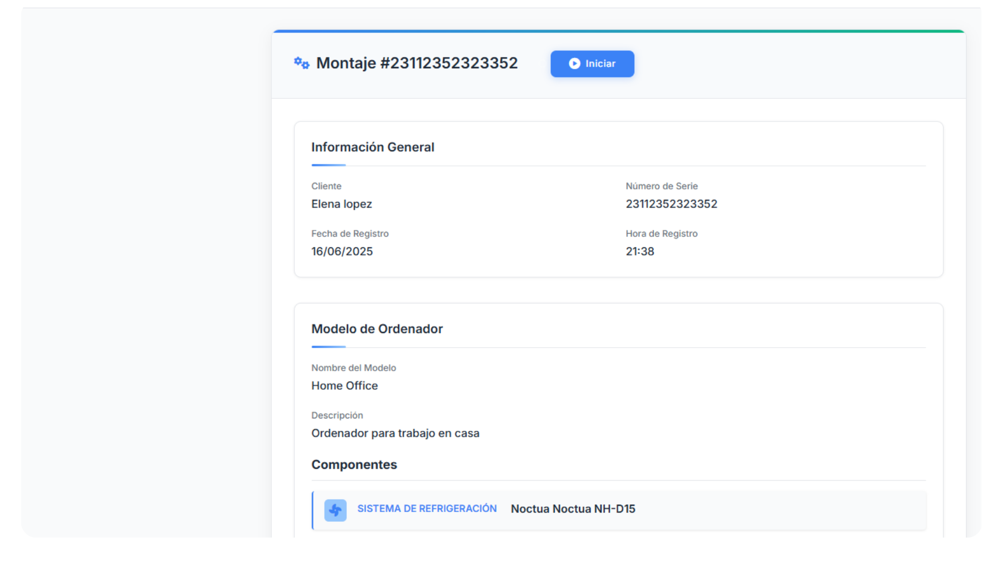
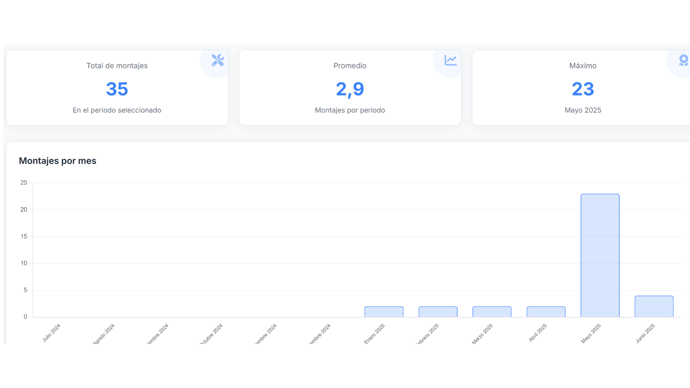
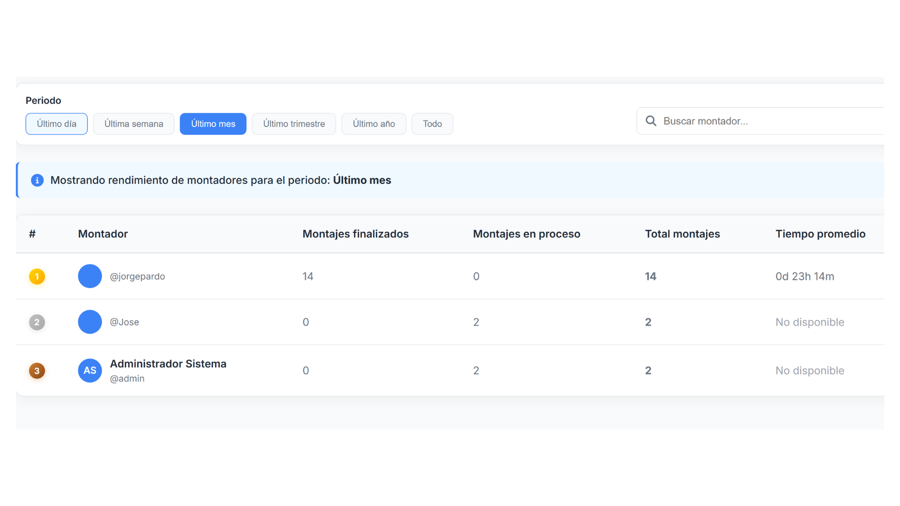

# Gestión de Montajes

Aplicación web desarrollada con Django para la gestión de montajes e instalaciones.

## Características

- Gestión de montajes y seguimiento de instalaciones
- Historial y estadísticas de montajes
- Sistema de autenticación de usuarios
- Interfaz de usuario moderna y responsiva

## Requisitos

- Python 3.8+
- Django 5.1.6+

## Instalación

1. Clona el repositorio
   ```
 git clone https://github.com/josemompean/gestion-montajes-django.git
cd gestion-montajes-django
   ```

2. Instala las dependencias
   ```
   pip install -r requirements.txt
   ```

3. Realiza las migraciones
   ```
   python manage.py migrate
   ```

4. Crea un superusuario (opcional)
   ```
   python manage.py createsuperuser
   ```

5. Inicia el servidor
   ```
   python manage.py runserver
   ```

6. Accede a la aplicación en tu navegador
   ```
   http://127.0.0.1:8000/
   ```

## Uso

- Inicia sesión o regístrate para acceder al sistema
- Gestiona montajes desde el dashboard principal
- Consulta el historial y estadísticas en la sección correspondiente

## Estructura del Proyecto

- `gestion_montajes/`: Aplicación principal de Django
- `montajes/`: Aplicación específica para la gestión de montajes
- `staticfiles/`: Archivos estáticos (CSS, JavaScript, imágenes)
- `requirements.txt`: Dependencias del proyecto

## Licencia

Este proyecto está licenciado bajo la Licencia MIT 

## Capturas del proyecto

### Panel principal de montajes


### Detalle de un montaje


### Dashboard de estadísticas


### Estadísticas por montador


### Historial de montajes finalizados
